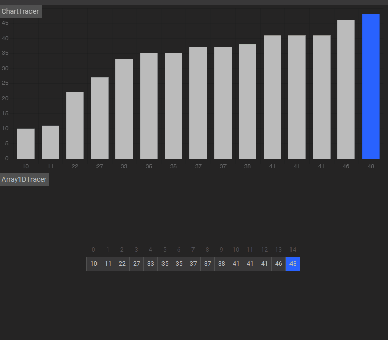

I was browsing GitHub today and I found something really interesting. [Algorithm Visualizer](https://algorithm-visualizer.org/) is something that you want to take a look at, if you are interested in learning some algorithms. Sometimes it is hard get a grasp of an algorithm from a written wall of text. In these cases having a graphical visualization of the steps definitely helps understanding the core concept of the algorithm.

At the moment there are 65 algorithms available for inspection. To start take a look at [Binary Search](https://algorithm-visualizer.org/branch-and-bound/binary-search). You clearly see how the array gets divided step-by-step:

As you can notice. Something like that explains binary search better than a thousand words. In the future, always when I want to tackle some algorithms, I will surely be using this awesome service.

If you don't find your favorite algorithm in the selection, you can create a pull request in the [algorithm repo](https://github.com/algorithm-visualizer/algorithms).

Have fun playing with it. :)
