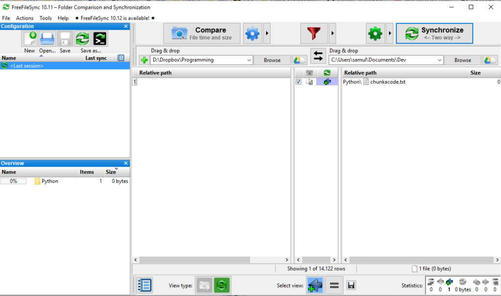
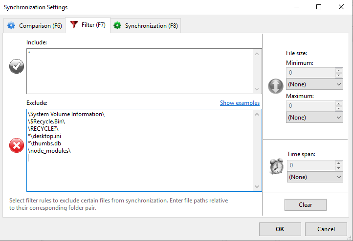

You may have had the need of coding on different computers while working on the same project. One common case could be that you need to work on a project on your personal computer and also on the work computer. In these cases you may wonder what is the best way to share files between work stations.

I don't know if this is the best way, but in this blog post I share with you guys how my setup is done. The first thing you need is [Dropbox](https://www.dropbox.com/). I use Dropbox only for development-related stuff. For anything else, I use [Google Drive](http://drive.google.com). Before I started programming, I used only Google Drive, but I wanted to have a clean slate and clutter-free environment for coding stuff, so I started using Dropbox on the side. If you want to use any other cloud service, feel free to do so. It doesn't change the functionality of the setup.

Dropbox by itself is not enough. I first just put my projects directly there, but quickly I stumbled on a problem. Working with node requires a huge dependency directory _node_modules_. The directory size is something like 200 MB and it contains hundreds of thousands of files. This is not good. Handling a huge amount of small files causes a significant performance issue on the processor. The Dropbox client keeps checking the file for changes and slows down the computer.

You need something to sync everything but the _node_modules_ folder. It is not possible to ignore a certain folder name recursively in the Dropbox client. It would be so nice to have a config file that worked like `.gitignore`. Not the easiest way for a non-programmer, but it would be easy enough for every power user. Anyway, this is a big limitation in my opinion and it cries for a solution.

I solved this with a program called [FreeFileSync](https://freefilesync.org/). What I do know is that I develop always locally. WHen I am done for the day, I open up FreeFileSync, run comparison and sync the files to Dropbox. I have excluded _node_modules_ folder from the sync settings, so when I sync the files, only the development files get synced. The process is super fast and there is no more performance issues.

This is the general view from FreeFileSync. On the left I have the files in Dropbox and on the right the local files. When I wish to upload the files to Dropbox, I always first compare them. That is the state in the image above. I have just compared the two destinations for differences. For the sake of this example, I created `chunkacode.txt` in the local folder so that there would be a visible change. Then I just hit _Synchronize_ and the files go to Dropbox.

This is how to setup the synchronization settings:

Just add `\node_modules\` in the exclusions. Everything else is there by default. If you wish to exclude something else, you may add in this list and you are done. `.git` folder may be something that you would like to exclude depending on your workflow. I just sync it because it is easier for me and I haven't had any problems. It contains thousands of small files though and therefore is not optimal to have in Dropbox.

I sync always the files manually at the end of the day, but you can setup also a scheduled syncing. For example, you could sync your files every 5 mins automatically. I won't dive into this as I don't use this feature personally, but feel free to play with it and let me know what kind of system you have!
