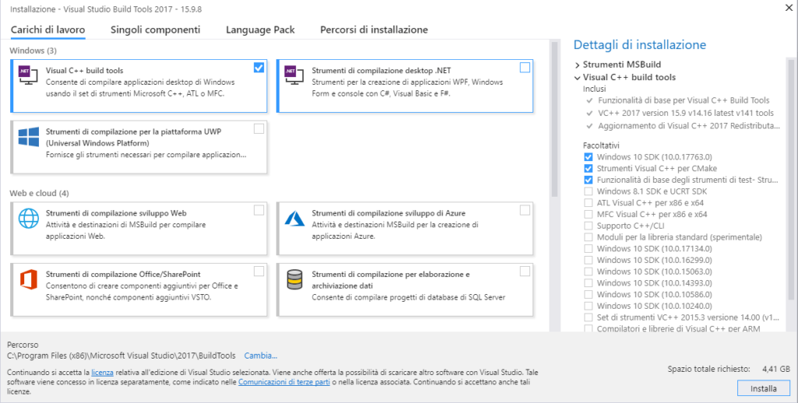

You might know that Python is build on top of the C programming language. C is an old, relatively low-level programming language that was first published in 1973. It means that today it has a long history of almost 50 years. That is a very long time for something that technological.

Nowadays C is known to be a very fast programming language. Much faster than Python. All compiled languages are faster than Python, but C is fast even compared to other compiled higher-level languages. Take a look at [blog post](https://jaxenter.com/energy-efficient-programming-languages-137264.html) to check which is the most energy efficient language.

Of course, if the speed of a language was the only criteria in the process of choosing a programming language for a project, everyone would just choose C and be done with it. This is now the case. The main criteria is usually the implementation time. Python is extremely powerful language in terms of implementation time, but it lacks pure speed. In order to overcome this disadvantage, it is possible to implement the most time consuming functions of a program in C and import them directly into the Python program. In this blog post I will show you how to do it on Windows 10. After a bit of research I noticed that there are not so many resources available on the Internet.

I have practically 0 experience on C. The point of this blog post is to show you how to implement a C extension, not to teach you how to program in C.

### Setting up the compiler

I am going to assume that you already have Python installed and you know how to use it. If this is the case, the first step for you is to download the correct C compiler and install in on your machine. If you don't have Python, please install it fist.

You can get the _Build Tools for Visual Studio 2017_ [here](https://visualstudio.microsoft.com/downloads/). Navigate down to _Tools for Visual Studio 2017_ and download the _Build Tools_.


After the download is complete, run the .exe file and the _Visual Studio Installer_ will be downloaded. Run the installer and select Visual C++ build tools and click _Install_.



Do not unselect the thee optional components on the right. I first tried installing only the build tools without any of the optionals, but then I wasn't able to run the compiler. I think that at least the _Windows 10 SDK_ is needed, I am not sure about the other two.

You will need to download 1.1 GB of data, so if you don't have a modern internet connection it will take a while. You will need to suffer and wait at this point. The positive side is that the installer will start installing the components while the download is ongoing, so when the download is completed, the some of the installation will already be done. Once the installation is done, you can just close the installer and you are good to go.

## First lines of C

I suggest you to create a virtual environment for the purpose of this excercise. You do not want to clutter up your main Python installation with these useless C libraries. I am going to assume that you are already familiar with virtual environment so that the post doesn't become too long.

Go to your project folder and create a file called `helloworldmodule.c` and the let's get started.

```
#include <Python.h>
```

This line imports the Python header file and make the [Python C API](https://docs.python.org/3.7/c-api/) available to use. Without this include line you wouldn't be able to work with Python code. If you created a virtual environment, you should be able to locate the header file in the _Include_ folder of the venv. In my case the path is `C:\Users\<Username>\Envs\CExt\Include\Python.h`.

Let's create our first C function.

```
static PyObject *
helloworld_say_hello(PyObject *self, PyObject *args)
{
    printf(Hello World\n);

    Py_RETURN_NONE;
}
```

As you can see, the first function we are going to be doing is a simple _Hello World_. What you see above is a module level python method in C. It is alway the same, only the name naturally may change. The function name is `say_hello` and it consumes `self` and `*args` as its arguments. The type of every Python object in C is `PyObject`. Then the function simply prints _Hello World_. Remember that in C you need to worry about line changes manually.

`Py_RETURN_NONE;` is a curious detail about the function. In Python we are used to that when a function or a method doesn't return anything, it will still return `None`. At C level, we need to take care about this manually. If we do not return tell C to return `None` it will not return anything at Python level. Not even `None`.

Next we are going to create a _method table_.

```
static PyMethodDef HelloWorldMethods[] = {
    {say_hello, helloworld_say_hello, METH_NOARGS, Say Hello World},
    {NULL, NULL, 0, NULL}};
```

This is were all the methods of the extension must be defined. In this extension, we have only one method, `say_hello`, so the table is rather simple. The first entry is the method name at Python level. It doesn't need to be the name as the method name at C level. The convention is that at C level the module name preceeds the method name like this: `<modulename>_<methodname>`. The Python name could be anything, but in order to keep things as clear as possible, I'll just leave it at `say_hello`. Note that the first entry is a string and the second entry refers directly to the method we created before.

`METH_NOARGS` is a flag that indicates the calling convention of the method. `METH_NOARGS` means that the method doesn't take any arguments. One other calling convention is `METH_VARARGS` which is used if your method takes one or more arguments (`args`) in tuple format representing all arguments passed to the method at Python level. For more information on calling conventions take a look at the [documentation](https://docs.python.org/3/c-api/structures.html#c.PyMethodDef).

The fourth entry points to the contents of the docstring.

The method struct must always end with `{NULL, NULL, 0, NULL}`. It tells the compiler that the method definitions are finished.

The next step is to create the module object definition. It holds all the information needed to create a module object.

```
static struct PyModuleDef helloworld =
    {
        PyModuleDef_HEAD_INIT,
        helloworld,
        ,
        -1,
        HelloWorldMethods};
```

The first entry is always `PyModuleDef_HEAD_INIT`. It is just something that is needed for every module. Next comes the name of the new module. This is the one that we are going to be importing from our Python file. The third entry is the docstring. In this case we can just put an empty string there.

`-1` means that the module has global state and therefore can't have be used in various sub-interpreters at the same time.

The last entry is a pointer to the method table that we defined before.

The last step of the C code is to actually create the module.

```
PyMODINIT_FUNC PyInit_helloworld(void)
{
    PyObject *module;
    module = PyModule_Create(&helloworld);

    if (module == NULL)
        return NULL;

    return module;
}
```

When the C extension is imported from the Python program, `PyInit_helloworld` will be called. Note that the function must have the same name as the module: `PyInit_<modulename>`. `PyModule_Create(&helloworld)` will be called and it returns a pointer to the module object that we just created based on the module object definition that we created before. Returning `NULL` from this function would be that the module object couldn't be created successfully.

We are now done with the C part of the program. Let's take a look at the `setup.py` next.

### Creating the setup.py file and building the C extension

`setup.py` is the file that is used for compiling the C extension. We are using `setuptools` for creating the extension. `setuptools` is a library used for creating all kinds of python packages, not necessarily only C extensions. Create a new file called `setup.py` in your project folder where you should already have also the `helloworldmodule.c` file.

```
from setuptools import setup, Extension

setup(
    name='helloworld',
    version='1.0',
    description='C Hello World Python Package',
    ext_modules=[
        Extension(
            'helloworld',
            sources=['helloworldmodule.c'],
            py_limited_api=True)
    ]
)
```

The keyword arguments are quite self-explanatory. If you decided to upload your module to [Python Package Index](https://pypi.org/), this data would show up there.

It is the `ext_modules` that we are interested about when our module contains C extensions. `ext_modules` modules is a list containing all external dependencies to be built when `python setup.py build` command is run. The type of the items in the list must be of `setuptools.Extension`.

The Extension class defines our C extension module. The first argument is the name of the module. The second one is a list of filenames. The filenames are relative to the `setup.py` root. In our case the `helloworldmodule.c` file is in the same directory with the `setup.py`, so we do not have to write out the absolute path.

That is all we need in order to build the extension and create the module.

Open the terminal and navigate to your project folder. Run the following commands.

```
python setup.py build
python setup.py install
```

You should now have the package installed in your virtual environment. The next step is to create a Python program in order to test our C extension.

### Running the C extension in a Python program

Create a new file called `main.py` in your project folder.

```
import helloworld


def main():
    helloworld.say_hello()


if __name__ == __main__:
    main()
```

Run the file and as a result you should see the words _Hello World_ in your terminal. If you see the words, well done! You can go take a break and start brainstorming some more complicated and useful extensions. Maybe some day you will challenge numpy's optimized methods with your own libraries.

If your code doesn't work, check that you don't get any errors when running `python setup.py build`. Go through the C part carefully. It is easy to make small mistakes there.

### Conclusion

Creating a C extension from scratch sure can be quite an intimidating and confusing task, if you don't have any previous experience from writing/reading C code. The [C API documentation](https://docs.python.org/3.7/c-api/) is a good place to start gathering more information if you are interested in creating something more useful or if you just want to learn some more.

Learning this stuff isn't surely waste of time, because it can help you understand a lot better how Python works under the hood.

If you come up with some cool extension, please share them in the comments below!
