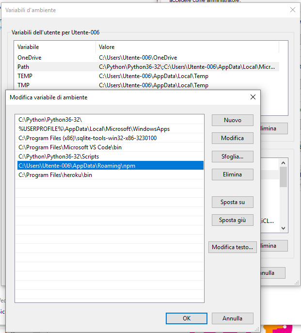
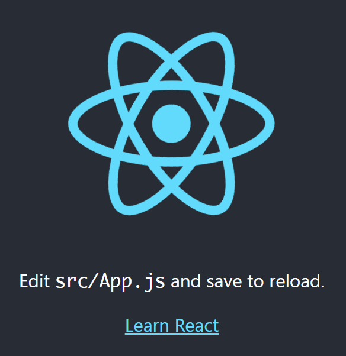

In this short guide we'll go through the necessary steps in order to make a simple React app.

## Initial setup

The first thing you need to do is install Node.js on your computer. You can download it from [here](https://nodejs.org/en/). Make sure you download the newest table release. The installation process is easy and the installer will get your through it step by step. Make sure you add Node to your Path. The installer should do it for you automatically. If it doesn't you can do it manually by adding it to your environment variables. If you don't know how to do it, check [this](https://www.architectryan.com/2018/03/17/add-to-the-path-on-windows-10/) tutorial by Ryan Hoffman.



When your path is correctly configured, you can test that it is working from the command prompt. Write in the command `node --version`. If it works, you will see the version of node.js in the prompt. You will need also a package manager to install external dependencies like react. Fortunately, the npm package manager comes in bundled with node.js. You may also test that it works in the command prompt by writing `npm --version`.

## Getting started with create-react-app

Starting using React has been made extremely easy. There is a boilerplate command, create-react-app, that takes care of all the setting up for your first app. So in order to create your first single page app you don't need to configure anything.

Navigate to your development folder and type in the command `npx create-react-app hello-world`. Run the command and all the necessary packages will be installed. This phase may take a minute or two depending on your connection speed.

Once the installation is done, you will find the project folder full of stuff. Notice that create-react-app automatically initialize a git repository for the project. If you don't want that, simply delete the git related files from the project directory.

The initial folder structure will be like this:

```
hello-world
├── README.md
├── node_modules
├── package.json
├── .gitignore
├── public
│   ├── favicon.ico
│   ├── index.html
│   └── manifest.json
└── src
    ├── App.css
    ├── App.js
    ├── App.test.js
    ├── index.css
    ├── index.js
    ├── logo.svg
    └── serviceWorker.js
```

Let's check that the newly created app is working. Go to the new folder and run `npm start`. After a short while, the app will automatically open in your default browser. The app is running on a server on port 3000 created by the create-react-app command. If your browser doesn't open automatically, just open a new tab your self and navigate to http://localhost:3000/. You should see the react logo spinning on the page.



So, everything seems to be working. Let's actually make something ourselves.

## Simplify the project

First, shut down the app from the command prompt and remove all the unnecessary files that we don't need in this example. That gives us a better idea on what is actually needed for a react app.

The new folder structure should look like this:

```
hello-world
├── node_modules
├── package.json
├── public
│   ├── favicon.ico
│   ├── index.html
│   └── manifest.json
└── src
    └── index.js
```

The open the _index.js_ in your text editor.

The starting point is this:

```jsx
import React from "react"
import ReactDOM from "react-dom"
import "./index.css"
import App from "./App"
import * as serviceWorker from "./serviceWorker"

ReactDOM.render(<App />, document.getElementById("root"))

// If you want your app to work offline and load faster, you can change
// unregister() to register() below. Note this comes with some pitfalls.
// Learn more about service workers: https://bit.ly/CRA-PWA
serviceWorker.unregister()
```

Also from this file, we can remove almost everything. Edit your file so that it results like here below:

```jsx
import React from "react"
import ReactDOM from "react-dom"

const App = () => {
  return <h1>Hello World!</h1>
}

ReactDOM.render(<App />, document.getElementById("root"))
```

Now, start the server again from the command prompt and the Hello World heading will be rendered on the page. The server is intelligent and allows for a fast development. For example, if you now change the _Hello World_ text to something else and save, you will notice that the server reloads the contents automatically. This way we can see the changes immediately.

## Conclusion

In this blog post I showed you how to create a simple bare-bones react app with only the necessary files. We used the create-react-app command, which creates a whole bunch of other stuff that we didn't cover. In the next post we'll take a look what's in the _Public_ folder and how we have can modify the static stuff on our app.
