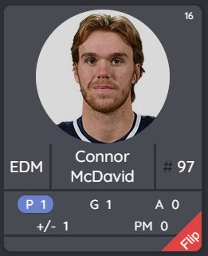

I created a hockey player fansite. I have been super busy lately between vacation, day job and my first ever full-blown fullstack application. I will write a bit about the design process.

## TL;DR

I am launching my first ever fullstack application, [Player Fan](https://www.player.fan). It is an NHL (National Hockey League) related website that allows you to follow specific players rather than teams, see their recent performance and have access to all their goal videos easily.

## What is the site about?

The site is about NHL **players**. It's main goal is to follow players, not teams. Following teams is already easy, just visit any sports site and they have team standings, game-by-game scores and some game videos easily available.

Following single players is more difficult. If you wanted to check a specific goal made by a specific player in a specific game, it is so much harder. That is what I build [Player Fan](https://www.player.fan) for. The user can easily view the hottest players of the recent games via player cards (image below) and check the goal videos of any player that has played at least one game during the season. Of course, the player has to have scored as well, otherwise there is no video available. 😊

A registered user can also add players to his personal favorite list to see their recent stats and goals quickly every day without having to go through game recaps hoping for their player to score. This is a huge time saver for fans with limited time. Once I got the videos working, I spent at least 1,5 hours just watching goals videos (_that time is excluded from the project time record that I show in a later chapter._ 🤣).

## How I came up with the idea

I have been a hockey fan since forever. I am Finnish and our national sport is ice hockey. There is no question about it. Football (soccer) doesn't come even close. I don't think there are any other countries beside Canada and Finland where the number one sport is undoubtedly ice hockey.

However, while you are a student, you have a lots of free time. If you, the reader, are a student and you disagree, just wait for the reality to hit you in the face when you start working and other stuff starts to invade you life. So, as a student I was able to follow teams, players and watch matches or at least the condensed games or game recaps. That has changed in the recent years and I haven't been following NHL that much at all. I still know more or less which teams are doing well and who won the Stanley Cup, but I haven't had the time to really follow the sport, even if my interest for it hasn't gone anywhere.

I decided that something needed to be done. I wanted to create something that allows me to follow my favorite players easily and efficiently without spending too much time that I don't have. From there, step-by-step, I started researching what was needed to create such a website. Some questions came up: _"Where to get the data?", "How to get the data?", "Is there an API?", "Is it expensive?", "Does this project provide value for others?", "Is this too big of a chunk for my current web development skills?"_

After a couple of hours of research I resolved to give it a go.

## Planning

I didn't do that much planning. I was so existed to get started that I just couldn't sit down for hours to think about how to structure the application and what was really needed. I just wanted to start getting some lines down.

That, of course, was a huge error and lead up to me refactoring a bunch of stuff many times over. I guess this is quite normal in software engineering, but sure some of it could have been avoided by some solid planning.

My planning basically went like this: "Ok. There is a cool undocumented API that surely will be fine for what I need it for. I also like [React](https://reactjs.org/), [GraphQL](https://graphql.org/learn/) and [Node.js](https://nodejs.org/en/) so I will use those. The DB will be [MongoDB](https://www.mongodb.com/), because Atlas is so easy to setup and I have used it in a smaller exercise."

The database might have been the biggest error, because I ended up using [Heroku](https://www.heroku.com/) for deployment and it has [PostgreSQL](https://www.postgresql.org/) integrated in it. Also, I ended up writing up some huge aggregation pipelines that probably would have been cleaner in SQL.

Anyway, _making_ mistakes is not stupid. Not _learning_ from them is. The next time I will contain myself and have a minimum requirement of a few hours planning before I can get started with coding.

## Project time table

I kept record of my working hours on this project. It is not 100 % perfect. I surely have missed some hours here and added some hours there. I usually can't work on a thing without interruptions, so keeping accurate record without a time tracking app (I didn't use one) is difficult.

I did also quite a bit of off-record studying. I had little experience with MongoDB before and close to zero experience on GraphQL and CSS before starting the project. I had to tackle all of those so I spent at least some 40 hours on studying those and reading documentation.

Also the task descriptions are somewhat vague and cryptic for someone who is not me. In any case I hope that it gives you and idea on how the project developed and may give some hint to beginner devs on how much time is needed for a complete web app. Sorry for the long table.

|    day     | time | tasks                                                             |
| :--------: | :--- | :---------------------------------------------------------------- |
| 09.06.2019 | 1    | getting started                                                   |
|            | 2    | working on fetch-data                                             |
| 10.06.2019 | 2    | studying api and working on fetch-data                            |
| 11.06.2019 | 3    | working on fetch-data                                             |
| 12.06.2019 | 2    | working on fetch-data. problems with db saving functionality.     |
| 13.06.2019 | 2    | fetch-data finally giving consistent results.                     |
|            | 2    | graphql initial setup done.                                       |
| 14.06.2019 | 4    | working on graphql schema.                                        |
| 15.06.2019 | 5    | working on resolvers.                                             |
| 16.06.2019 | 5    | getting started with frontend                                     |
| 17.06.2019 | 4    | css basic styling                                                 |
| 18.06.2019 | 2    | css basic styling                                                 |
|            | 2    | react router and navbar styling                                   |
|            | 1,5  | started to implement semantic-ui instead of styled components     |
| 19.06.2019 | 2,5  | semantic-ui implentation for now done. added user model in db     |
| 20.06.2019 | 5    | implemented login system, user creation and forgot password       |
|            | 1    | implemented cookies                                               |
| 24.06.2019 | 3,5  | worked on the login system and personalized view for logged users |
|            | 1    | profile page for logged users                                     |
| 25.06.2019 | 4,5  | notification system done. started to work on player algorithm     |
|            | 1,5  | best player algorithm                                             |
| 26.06.2019 | 2,5  | best player algorithm                                             |
|            | 1    | frontend error handling                                           |
| 28.06.2019 | 2    | studied apollo hooks and tried implementing them                  |
|            | 3    | implemented player following in the backend                       |
| 30.06.2019 | 3    | studied contextAPI and useContext hook                            |
|            | 4    | code refactoring, implementing contextAPI                         |
| 01.07.2019 | 6    | working on AuthContext and favoritePlayers view                   |
| 02.07.2019 | 5    | working on Heroku deployment                                      |
| 03.07.2019 | 1    | working on Heroku deployment                                      |
|            | 3    | apollo-express setup and apollo cache debugging                   |
| 04.07.2019 | 3    | fixed a bug in apollo cache. sort by gameDate instead of gamePk   |
|            | 1    | working on the ui                                                 |
| 05.07.2019 | 5    | created search functionality                                      |
| 06.07.2019 | 5    | worked on search and production version of the application        |
|            | 1    | bug fix in the reduce-stats program                               |
| 07.07.2019 | 4    | unit tests                                                        |
| 08.07.2019 | 5    | unit tests and started studying tests for graphql                 |
| 09.07.2019 | 5    | units tests for graphql schema                                    |
|            | 1    | searched for a source for player images and found one             |
| 10.07.2019 | 4    | first version of player stats done. still needs a lot of work.    |
|            | 2    | thinking how to reorganize the database                           |
| 11.07.2019 | 4    | started the db reorganization                                     |
| 12.07.2019 | 5    | worked on data fetching scripts                                   |
| 14.07.2019 | 2    | data fetching scripts                                             |
| 15.07.2019 | 2    | data fetching scripts                                             |
| 16.07.2019 | 5    | data fetching scripts                                             |
| 17.07.2019 | 4    | finished the data fetching and created script for best players    |
| 18.07.2019 | 2    | fixed unit test after significant changes in data structures      |
| 19.07.2019 | 4    | bug fixes and cumulativestats resolver                            |
| 20.07.2019 | 8,5  | cumulative stats in fe and be. sorting and pagination working.    |
| 21.07.2019 | 8    | working on standings, backend and frontend                        |
| 22.07.2019 | 6,5  | refactored the schemas and did the first proto of player profile  |
| 23.07.2019 | 6    | fixed a cache bug and worked on the player profile.               |
| 24.07.2019 | 5    | added support for milestones (goal videos on player profiles)     |
| 25.07.2019 | 4    | working on the player profile / milestones                        |
| 26.07.2019 | 2    | added backside to the player cards                                |
| 28.07.2019 | 4    | best players optimization, stats table refactoring                |
| 29.07.2019 | 2    | stats table refactoring                                           |
|            | 4    | starting to design the final layout with styled components        |
| 30.07.2019 | 6    | working on player cards                                           |
| 31.07.2019 | 6    | working on player cards and card container                        |
| 02.08.2019 | 3    | working on layout                                                 |
| 03.08.2019 | 4    | working on layout                                                 |
| 05.08.2019 | 4    | working on layout                                                 |
| 06.08.2019 | 5    | working on layout                                                 |
| 07.08.2019 | 6    | working on layout                                                 |
| 08.08.2019 | 4    | working on layout                                                 |
| 09.08.2019 | 2    | Refactoring the navigation bar                                    |
| 27.08.2019 | 2    | Refactoring the navigation bar                                    |
| 28.08.2019 | 4    | Finished nav bar                                                  |
| 29.08.2019 | 4    | Working on player profile                                         |
| 30.08.2019 | 4    | Working on stats and standings                                    |
| 31.08.2019 | 4    | Working on search                                                 |
| 01.09.2019 | 4    | Working on search                                                 |
| 02.09.2019 | 4    | Working on search page                                            |
| 03.09.2019 | 4    | Working on team profile                                           |
| 04.09.2019 | 4    | Working on team profile                                           |
| 05.09.2019 | 6    | Team profile and team links. Added fallback images.               |
| 06.09.2019 | 6    | Refactored StatsTable and added highlighting                      |
| 07.09.2019 | 6    | Created loader and started working on sign up modal               |
| 08.09.2019 | 5    | Started working on forms                                          |
| 10.09.2019 | 4    | Added mailgun and relative functions                              |
| 11.09.2019 | 6    | Working on forms                                                  |
| 12.09.2019 | 5    | Working on forms, setup logo and favicons                         |
| 13.09.2019 | 5    | Improved mobile navi, added google analytics                      |
| 14.09.2019 | 4    | Cookie policy                                                     |
| 15.09.2019 | 4    | Added cookie consent banner and remember be on login              |
| 22.09.2019 | 5    | Created a new aggregation pipeline for best players               |
| 23.09.2019 | 5    | Added support for the new aggregation in frontend                 |
|   total    | 340  |                                                                   |

One of my hurdles was definitely how to style the site. It is not clear from the time records, but I attempted styling the site three times. First with [styled-components](https://www.styled-components.com/), then with [semantic-ui](https://react.semantic-ui.com/) and then in August I did everything again with [styled-components](https://www.styled-components.com/).

If you are a seasoned programmer and you skimmed through the table, you surely also noticed that I've done almost no testing at all. I know. I should've have done some testing from the beginning. Tests are something I will definitely have to add to avoid future headaches.

I stopped recording the hours a bit more than a week ago, but I am still working on the project.

## Future plans in the pipeline

I am full of new ideas for the site. The season has started and the first version of the site is out, but there is so much more to come. The current plan is to convert the site into a more social network like user interface with the possibility comment on videos and vote for the best ones.

Everything is still open though. If you have an idea or a feature request, please leave a comment below, contact me via the contact form on the [site](https://www.player.fan) or tweet me at [@playerfansite](https://twitter.com/playerfansite).

Thanks for reading.
