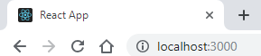

In the [last](../how-to-make-a-simple-react-app/) blog post we saw how to create a simple react app by using the `create-react-app` command. In this post we will quickly go through what are the files in the public folder and what they do. The files get created automatically by `create-react-app`. The files are three:

- favicon.ico
- index.html
- manifest.json

All the files in the Public folder can be referenced from the `index.html` file by `%PUBLIC_URL%` syntax.

## Favicon

The favicon is an icon that is used in your application as its logo. they are often found, for example, on browser tabs or as a logo on your desktop or smart home screen.



The favicon used by `create-react-app` is in .ico format, which is recommended, but in all modern browser .jpg, .png and .gif formats are accepted.

The .ico format is recommended, because one file can contain various dimensions that can be used in different occasions. For example, on my Chome tabs the default favicon size is 16x16, but as desktop icons we will need something bigger for sure. It is good to include 32x32 and 48x48 size as well.

The favicon is referenced in the `index.html` file:

```html
<link rel=shortcut icon href=%PUBLIC_URL%/favicon.ico />
```

## Site template index.html

The `index.html` file in the Public folder is used as the template file of the app.

```html
<html lang="en">
  <head>
    <meta charset="utf-8" />
    <link rel=shortcut icon href=%PUBLIC_URL%/favicon.ico /> <meta name=viewport
    content=width=device-width, initial-scale=1 />
    <meta name="theme-color" content="#000000" />
    <link rel=manifest href=%PUBLIC_URL%/manifest.json />
    <title>React App</title>
  </head>
  <body>
    <noscript>You need to enable JavaScript to run this app.</noscript>
    <div id="root"></div>
  </body>
</html>
```

The interesting part of this file is that it links to our `favicon.ico` and `manifest.json` files. Here we could also change the default app name _React App_ in the title tags to something more personal.

Note that all the dynamic content of the app will be injected in the root div:

```
<div id=root></div>
```

You may notice that the JavaScript files in the `src` folder seem to have no connection to this template file. The connection will be created by the build process and the script tags will appear when your run your app and inspect the page. This is what I find at the bottom of the body tag of my default `create-react-app` app.

```html
<script src=/static/js/bundle.js></script>
<script src=/static/js/0.chunk.js></script>
<script src=/static/js/main.chunk.js></script>
```

## How about the manifesto?

`manifest.json` is the file that _describes_ the app. The details in this file will be used in app-like conditions, like when you _install_ the react app on your desktop or smart phone.

```js
{
  short_name: React App,
  name: Create React App Sample,
  icons: [
    {
      src: favicon.ico,
      sizes: 64x64 32x32 24x24 16x16,
      type: image/x-icon
    }
  ],
  start_url: .,
  display: standalone,
  theme_color: #000000,
  background_color: #ffffff
}
```

The minimum requirements for the `manifest.json` file is `short_name` or `name` property. The `name` property is used on the installation prompt and the `short_name` wherever the space may be limited, for example, on smart phones home screen.

`icons` property is where you can define the different icons for your application. In case of .ico file, your may define more than one size without stretching the image.

`start_url` is defined as an entry point for your application. The application will start from here when launched. `display` defines in which display mode the application is launched. `standalone` means that app open in its own window as if it were a native application, independent from the browser. `browser` would launch the app just like in a standard browser.

`background_color` is used as the background color of the splash screen when the app is first launched. `theme_color` defines the color for the tool bar.

## Conclusion

That was a quick overview on what is in the public folder when you create a react app using the `create-react-app` command. This answer to the questions that came to me when I first created a react app and saw a bunch of files created automatically.
